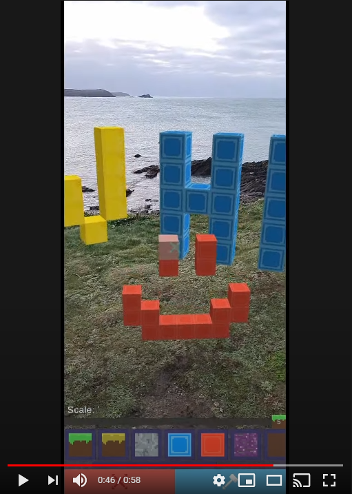

# ar-block-builder

Example Alternate Reality app built in **Unity** using **AR Foundation** and **ARCore XR**.

## Features

- Build 3D structures by placing blocks on a detected plane in real space
- Auto snap blocks to each other
- Change block types with different materials
- Change block scale
- Destroy placed blocks
- Highlight block surface using rays for specific placement

## Example Use

[AR Block Builder on Youtube](https://www.youtube.com/watch?v=0X1_jDe0fPA "AR Block Builder Youtube Video")